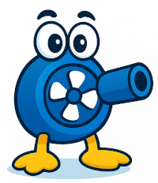

# OnlyFansTurret ;)


<div style="text-align: center;">
  
</div>

## Description

**OnlyFansTurret** is an interactive web service that allows users to remotely control a toy turret and watch its live video stream.

At any given time, **one user has full control** over the turret, including rotation, tilt, and firing rockets.  
Other users can **only watch the camera feed**.

Access is managed through a **queue system**: the next user in line gains control once the current session ends.

## Features

*   Video streaming: Real-time video streaming from devices.
*   Remote control: Controlling devices remotely.
*   Web interface: A user-friendly web interface for managing devices and viewing streams.

## How this works:
The service consists of three parts:
- **Device server** – manages the device, accepts commands via [gRPC](https://grpc.io/), and streams video via [GStreamer](https://gstreamer.freedesktop.org/).
- **Web server** – renders the web page and video, using WebSocket (WS) for server communication.
- **Device** - communicates and receives commands via the serial port.

## Architecture diagram
```
                    ┌────────────────────────┐
                    │        User (Browser)  │
                    │  Web UI (WebSocket)    │
                    │  WebRTC Peer (P2P)     │
                    └────────────┬───────────┘
                                 │ WS (control)      ▲
                                 │                   │ WebRTC (P2P) (ICE via TURN)
                    ┌────────────▼────────────┐      │
                    │        Web Server       │◀─────┘
                    │ (HTTP + WS + gRPC client│
                    │  + WebRTC gateway/agent)│
                    └────────────┬────────────┘
                                 │ gRPC
                                 │
                    ┌────────────▼────────────┐
                    │      Device Server      │
                    │ (gRPC server + GStream) │
                    │  - Camera capture       │
                    │  - gstreamer → WebServer│
                    └────────────┬────────────┘
                                 │ Serial (device control)
                                 │
                    ┌────────────▼────────────┐
                    │        Physical Device  │
                    │ (serial-controlled MCU) │
                    └─────────────────────────┘

External NAT helper:
┌──────────────────────────────┐
│           coturn             │
│  (STUN/TURN for ICE relay)   │
└──────────────────────────────┘
```

```mermaid
%%{init: {'theme': 'default', 'themeVariables': { 'primaryColor': '#4C9AFF', 'edgeLabelBackground':'#ffffff', 'actorTextColor': '#000000' }}}%%
graph TD

    %% === LAYERS ===
    subgraph Frontend [🌐 Frontend Layer]
        U[User (Browser)]
    end

    subgraph Backend [🖥️ Backend Layer]
        WS[Web Server<br/>• Handles WS & HTTP<br/>• Manages WebRTC Signaling]
        DS[Device Server<br/>• Handles gRPC<br/>• Controls GStreamer Video]
    end

    subgraph Device [⚙️ Device Layer]
        D[Physical Device<br/>• Serial Connection]
        CAM[Camera<br/>• GStreamer Source]
    end

    subgraph Network [🌍 Network Infra]
        TURN[coturn Server<br/>• NAT Traversal<br/>• WebRTC Relay]
    end

    %% === CONNECTIONS ===
    U <-->|WebSocket / WebRTC| WS
    WS <-->|gRPC| DS
    DS <-->|Serial| D
    DS -->|Video Stream (GStreamer)| WS
    WS -->|WebRTC P2P| U
    WS --- TURN
    CAM -->|RTSP / GStreamer| DS
```

## Prerequisites

*   Rust toolchain
*   Docker (optional, for containerization)

## Build and Run

1.  **Build the project and run the server:**

    ```bash
    docker compose up
    ```
    
## Demo video
[🎬 Watch demo video](web_server/web//demo.mp4)


## Contributing

Contributions are welcome! Please submit pull requests with detailed descriptions of your changes.

